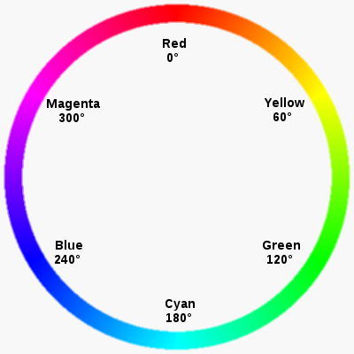

# Introduktion till CSS

---

## Vad vi kommer gå igenom

- Vad CSS är och gör
- Hur man använder CSS-regler
- Färger i CSS
- Specifika egenskaper och hur man stilar en tabell

---

## Anatomin för en webbsida

- Ditt innehåll (text, bilder)
- HTML: Strukturen
- CSS: Presentationen (utseendet)

En hemsida är ett sätt att presentera ditt innehåll till världen, genom att använda HTML för att strukturera innehållet, och CSS för att få det att se bra ut.

---

## Vad är CSS?

- Står för Cascading Style Sheet
- Stylesheet "language"/Stilmallsspråk
- Används tillsammans med HTML, men är inte HTML

---

## Vad kan CSS göra?

- Färga text/element
- Ändra storlek och position
- Styra utseendet på en hemsida
- Tillsammans med HTML, skapa en layout

---

## Syntax (hur det ser ut)

```css
p {
  color: #af0e12;
  font-size: 16px;
}

.intro {
  font-weight: bold;
}

#container {
  background: #000;
}
```

---

## CSS regel


Bildkälla: [Girl Develop It](http://girldevelopit.github.io/gdi-featured-html-css-intro/class2.html#/9)

---

### CSS-regel

```css
selector {
  property: value;
}
```

- Ett block med CSS kallas **regel**
- En regel börjar med en **Selector**
- En regel har en uppsättning **egenskaper** (properties) och dess **värden** (values)
- Egenskap och dess värde kallas **Deklaration**

---

## 3 sätt att länka CSS med HTML

- Inline
- Embedded
- External

---

### Inline

```html
<p style="color:red">Lite röd text.</p>
```

- Använder HTML-attributet `style`
- Appliceras endast på den specifika taggen
- Bör inte användas (svår använda och uppdatera)

---

### Embedded

```html
<head>
  <style type="text/css">
    p {
      color: #af0e12;
      font-size: 16px;
    }
  </style>
</head>
```

- Läggs direkt i head-taggen, och använder en style-tagg.
- Används endast i den specifika HTML-filen

---

### External (linked)

```html
<head>
  <link rel="stylesheet" type="text/css" href="style.css" />
</head>
```

- Flera sidor kan använda samma stilmall
- Lättare att underhålla och utveckla
- Kan cachas (sparas) av webbläsaren = snabbare hemsida

---

### Element/tag selector

Regel för att stila alla element av en viss typ

```css
p {
}

h1 {
}

li {
}

td {
}
```

---

### Deklaration

```css
color: red;
background: blue;
font-weight: bold;
font-size: 16px;
font-family: Verdana, san-serif;
```

---

### Tillsammans blir de en CSS-regel

```css
p {
  color: red;
  font-weight: bold;
  font-size: 16px;
}
```

---

### Vissa deklarationer ärvs

```css
/* Stilar body-elementet, font-family och color ärvs */
body {
  font-family: Verdana, sans-serif;
  color: gray;
}

/* Stilar alla element */
* {
}
```

---

## Man kan kombinera element som ska ha samma uppsättning av deklarationer

```css
p,
li,
h2 {
  color: #444;
}
```

---

## Det finns mängder med egenskaper (properties), och varje property har olika värden

För att göra det enklare för oss så använder vi en referens, som till exempel [Mozilla Developer Network](https://developer.mozilla.org/en-US/docs/Web/CSS/CSS_Properties_Reference).

Och som med mycket i teknik, om du inte kan det - googla det!

---

### Färgvärden

- Color keywords
- Hex (hexadecimal)
- RGBA (Red Green Blue Alpha)
- HSLA (Hue Saturation Lightness Alpha)

---

### Color keywords

Namngivna, specifika färger

<ul>
  <li style="color: red">Red</li>
  <li style="color: silver">Silver</li>
  <li style="color: aqua">Aqua</li>
</ul>

Moderna webbläsare stödjer [140 färger](https://htmlcolorcodes.com/color-names/)

---

### Hex

Hexadecimal-värdet för en färg.
[Hexadecimal-talsystemet](https://sv.wikipedia.org/wiki/Hexadecimala_talsystemet) använder siffror 0 till 9, och sedan A till F för att få till 16 olika siffror. Hex-värde som färg använder ett 6-siffrigt tal.

<ul>
  <li style="color: #FFF">#FFF, samma som #FFFFFF</li>
  <li style="color: #AF0E12">#AF0E12, mörk röd</li>
  <li style="color: #444">#444, mörkgrå</li>
</ul>

---

### RGBA

- Red, Green, Blue, Alpha
- RGB: Värde mellan 0 till 255, eller 0% till 100%
- Handlar om hur mycket av en färg som används
- Alpha är mellan 0 och 1, och hanterar transparens
- Kan använda RGB endast (alpha blir då 1, opak/opaque)

<ul>
  <li style="color: rgba(255, 255, 255, 1)">rgb(255, 255, 255, 1)</li>
  <li style="color: rgba(255, 0, 0, .5)">rgba(255, 0, 0, .5)</li>
  <li style="color: rgb(128, 80, 200)">rgb(128, 80, 200)</li>
</ul>

---

### HSLA

Hue, Saturation, Lightness, Alpha

---

### Hue (nyans): Vilken nyans som används, utifrån ett färghjul



Bildkälla: [Wikimedia](https://upload.wikimedia.org/wikipedia/commons/a/a4/RGB_color_circle.png)

---

### Saturation, Lightness, Alpha

- **Saturation:** Satuering, hur intensiv färgen är (mindre blir mer gråskala)
  Sätts som 0-100%
- **Lightness:** Ljushet, hur ljus färgen är
  Sätts som 0-100%
- **Alpha:** Hur transparent färgen är - fungerar på samma sätt som i RGBA

---

### HSLA exempel

<ul>
  <li style="color: hsla(240, 100%, 75%, 1)">hsla(240, 100%, 75%, 1)</li>
  <li style="color: hsla(0, 100%, 45%, 0.5)">hsla(0, 100%, 45%, 0.5)</li>
  <li style="color: hsla(67, 50%, 100%, 0.3)">hsla(67, 50%, 100%, 0.3)</li>
</ul>

---

### HSLA exempel 2

<ul>
  <li style="color: hsl(359, 85%, 37%)">hsl(359, 85%, 37%)</li>
  <li style="color: hsl(359, 70%, 50%)">hsl(359, 70%, 50%)</li>
  <li style="color: hsl(359, 25%, 37%)">hsl(359, 25%, 37%)</li>
  <li style="color: hsl(179, 25%, 37%)">hsl(179, 25%, 37%)</li>
</ul>

---

## Specifika egenskaper

Vissa element har specifika egenskaper, till exempel tabeller.

---

```css
table {
  border-collapse: collapse;
}

table,
tr {
  border: 5px solid purple;
}

th {
  background: #444;
}
```

<table id="hero-table">
  <tr>
    <th>Hero</th>
    <th>Alter-ego</th>
    <th>Power</th>
  </tr>
  <tr>
    <th>Iron Man</th>
    <td>Tony Stark</td>
    <td>Super-powered suit</td>
  </tr>
  <tr>
    <th>Captain America</th>
    <td>Steve Rogers</td>
    <td>Super-human strength</td>
  </tr>
  <tr>
    <th>Spider-man</th>
    <td>Peter Parker</td>
    <td>Web slingers</td>
  </tr>
</table>

---

### Övningar:

- Stila alla h1-element
  Ändra minst storleken och färgen
- Stila alla paragrafer på valfritt sätt
- Stila tabellcellernas bakgrund

---

## Källor:

- [Mozilla Developer Network: CSS reference](https://developer.mozilla.org/en-US/docs/Web/CSS/Reference)
- [Mozilla Developer Network: CSS Properties](https://developer.mozilla.org/en-US/docs/Web/CSS/CSS_Properties_Reference)
- [Styling table](https://developer.mozilla.org/en-US/docs/Learn/CSS/Building_blocks/Styling_tables)
