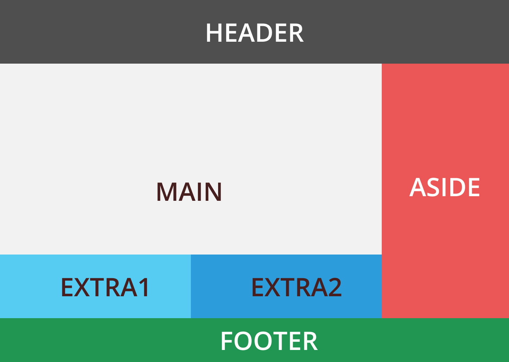
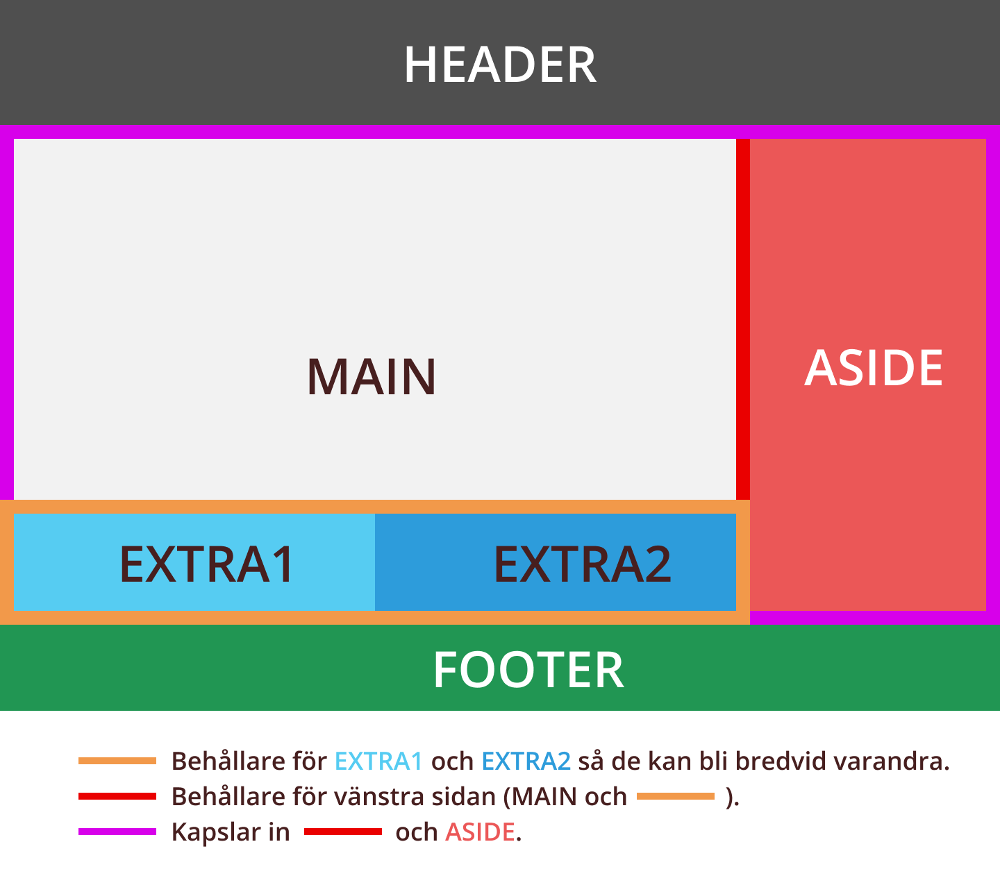

CSS Grid är ett relativt nytt sätt att skapa layouter med hjälp av CSS. Grid på svenska är Rutnät, och innebär alltså att du lägger ut dina element utifrån ett satt rutnät som du har definierat.

CSS Tricks har skrivit en [väldigt bra artikel om hur CSS Grid fungerar](https://css-tricks.com/snippets/css/complete-guide-grid/). Kolla in den, samt mina genomgångar om CSS Grid.

En notering om Grid är att det är svårt att lära sig precis allt om hur Grid fungerar, och mycket av kunskapen om grid kommer vara utifrån specifika användningsområden.
Därför begränsar jag också vad jag lär ut, och fokuserar på det viktigaste med grid, nämligen att lägga ut en övergripande layout på hemsidor och komponenter.

## Videogenomgångar

- [Del 1: Introduktion](https://youtu.be/QUozc9PFXNI)
- [Del 2: Layoutexempel](https://youtu.be/OJo8gCHVODc)

## Skillnader från Flexbox

Den främst skillnaden mellan Flexbox och Grid är att där Flexbox använder en dimension, så använder Grid två dimensioner för att lägga ut elementen.

Flexbox ger dig alltså en rad eller kolumn där dina element kan läggas. Det gör att vi kan skapa behållare (container) vars child-element då "flexar", alltså de lägger sig på en rad och vi kan använda olika sätt för att de ska fylla upp hela behållaren.
Vi kan sätta att behållaren ska göra en radbrytning om det inte finns utrymme för fler child-element, och därmed skapas fler rader, men den flexar fortfarande bara på en dimension.

Grid däremot ger dig både rader och kolumner där dina element kan läggas ut. Det gör att vi kan skapa behållare (container) vars child-element läggs ut utifrån ett rutnät, och kan mycket bättre bestämma och ändra storleken på child-elementen.

För att skapa vissa designs med endast Flexbox så behöver vi ofta använda flera behållare.

Säg att vi har följande layout:

För att skapa denna layout i Flexbox så behöver vi kapsla in EXTRA1 och EXTRA2 i en flexbox-behållare så de läggs bredvid varandra.
Sedan behöver vi kapsla in MAIN och Extra-behållaren i en behållare, för att sedan lägga in den behållaren och ASIDE i en flexbox-behållare så de läggs bredvid varandra.

I CSS Grid så kan vi istället säga åt varje element att lägga sig på de platser där de ska vara, utan att behöva skapa några behållare alls. Svårigheterna då blir istället att definiera hur stora raderna och kolumnerna ska vara.
Fördelen med Grid jämfört med flexbox kommer även om vi vill ändra om hela layouten, eller ett elements plats. Flexbox kan ändra ordningen av elementen, men inte var varje element ska vara.
Dessutom kräver flexbox att vi kapslar in våra element, vilket gör att får svårare att ändra layouten med till exempel media queries, och ofta måste vi flytta element med JavaScript istället.
Med Grid kan vi generellt skriva mindre kod, både HTML och CSS, men oftast med bättre resultat.

För mer information om skillnader och likheter mellan Flexbox och Grid, kolla in [denna videon som förklarar det](https://www.youtube.com/watch?v=HYji_V2aYa0). Videon i sig är en del av en hel kurs om CSS Grid av Wes Bos.

## Källor:

- [MDN: CSS Grid Layout](https://developer.mozilla.org/en-US/docs/Web/CSS/CSS_Grid_Layout)
- [Mozilla Developer Playground: CSS Grid tutorial](https://mozilladevelopers.github.io/playground/css-grid)
- [Mozilla Developer Playground video 1: Terminology](https://www.youtube.com/watch?v=s-sYjp9-K6E)
- [CSS Tricks: A complete guide to CSS Grid](https://css-tricks.com/snippets/css/complete-guide-grid/)
- [Video: Traversy Media: CSS Grid Crash Course](https://www.youtube.com/watch?v=jV8B24rSN5o)
- [Video: CSS Grid in 45 minutes](https://www.youtube.com/watch?v=DCZdCKjnBCs)
- [Spellista: Wes Bos: CSS Grid Course](https://www.youtube.com/watch?v=T-slCsOrLcc&list=PLu8EoSxDXHP5CIFvt9-ze3IngcdAc2xKG)
- [Spellista: Kevin Powell: CSS Grid](https://www.youtube.com/watch?v=plRcoRqLriw&list=PL4-IK0AVhVjPv5tfS82UF_iQgFp4Bl998)
- [Video: Progression of CSS layouts (historia)](https://www.youtube.com/watch?v=R7gqJkdc5dM)
