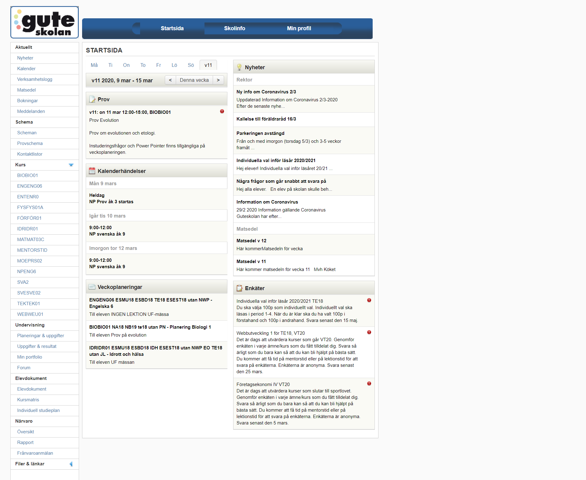
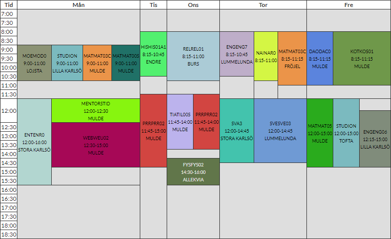

I det här projektet ska du använda [BEM](https://guteteknik.netlify.com/webb2/utvecklingspraxis/bem-metodiken/) för att översätta din dashboard design till HTML och CSS.

Identifiera vad som är Block, Element, och om du har några varianter som ska läggas in som Modifiers.

I övrigt arbetar du som vanligt med din HTML och CSS.

<Notice>

Om du inte har en design i Figma som du kan använda, återskapa delar av SchoolSofts ursprungliga design.

</Notice>

## Dokumentera och reflektera
När du avslutat så skriver du en kort reflektion om ditt arbete. Du ska minst svara på följande frågor, men det måste inte vara upplagt som "fråga -> svar":
- Vad gick bra?
- Vad gick mindre bra?
- Vad kan du göra bättre nästa gång?

Förslagsvis skriver du din dokumentation i en egen sektion under din dashboard, i en kommentar i javascript-delen (om du använder CodePen), eller på en egen sida (om du jobbar i VSCode).

# Inlämning
Inlämning görs antingen genom att du länkar din Pen på CodePen som du arbetat i, eller om du arbetat i VSCode så laddar du i första hand upp det till Netlify som en hemsida och länkar den, eller i andra hand zippar du ihop filerna och laddar upp till SchoolSoft.

Du arbetar på uppgiften under två lektionstillfällen.

# Checklista innan inlämning
- Alla dina HTML-element som behöver ha klassnamn har det.
- Du har namngivit dina Block, Element, och Modifiers korrekt och på ett tydligt sätt (inte tex class3 för ett en profilbild).
- Din CSS upprepar sig så lite som möjligt. Alltså att du har skrivit så lite CSS som du bara kan för att få fram din design. Leta i din kod efter ställen där du upprepar dig eller där det finns dubletter i kod.
- Ditt dashboard liknar den design du försökte återskapa.
- Du har skrivit en reflektion (se ovan).

## Moment i kursplanen som berörs:

- Utvecklingsprocessen för ett webbtekniskt projekt med målsättningar, planering, specifikation av struktur och design, kodning, optimering, testning, dokumentation och uppföljning.
- Fördjupning i märkspråk där det huvudsakliga innehållet är standarderna för HTML och CSS...
- Språk med stöd för variabler för att förenkla CSS-generering.
- Riktlinjer för god praxis inom webbutveckling.

## Bedömning

### C-nivå:

- Eleven gör en genomarbetad projektplan för en tänkt produkt. Utifrån projektplanen utvecklar eleven efter samråd med handledare produkten där logiker som styr innehåll, design och beteende är åtskilda.
-  I arbetet utvecklar eleven kod som med tillfredsställande resultat följer standarder och som omfattar några tekniker för märkspråk och stilmallar där eleven använder tekniker för att generera stilmallskod.
-  I arbetet bearbetar eleven med tillfredsställande resultat och via flera moment text, bild och eventuell annan media så att de blir anpassade för att fungera i produkten.
- När arbetet är utfört gör eleven en noggrann dokumentation av de moment som har utförts samt utvärderar med nyanserade omdömen sitt arbete och resultat. I utvärderingen resonerar eleven kring eventuella avvikelser samt motiverar översiktligt de val som har gjorts.

### A-nivå:
- Eleven gör en genomarbetad projektplan för en tänkt produkt, vid behov reviderar eleven planen. Utifrån projektplanen utvecklar eleven efter samråd med handledare produkten där logiker som styr innehåll, design och beteende i omfattande utsträckning är åtskilda.
-  I arbetet utvecklar eleven kod som med gott resultat följer standarder och som omfattar flera tekniker för märkspråk och stilmallar där eleven i omfattande utsträckning använder tekniker för att generera stilmallskod.
-  I arbetet bearbetar eleven med gott resultat och via flera moment text, bild och eventuell annan media så att de blir anpassade för att fungera i produkten.
- När arbetet är utfört gör eleven en noggrann och utförlig dokumentation av de moment som har utförts med koppling till generella principer och testresultat samt utvärderar med utförliga och nyanserade omdömen sitt arbete och resultat samt ger förslag på hur arbetet kan förbättras. I utvärderingen resonerar eleven kring eventuella avvikelser samt motiverar utförligt de val som har gjorts.

# SchoolSoft dashboard:

# Schoolsoft Schema

